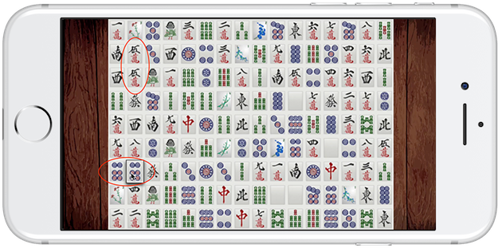
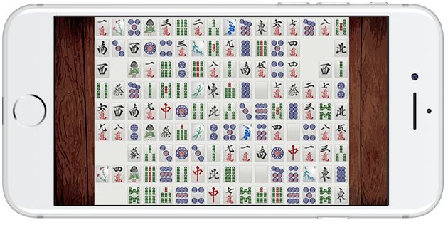
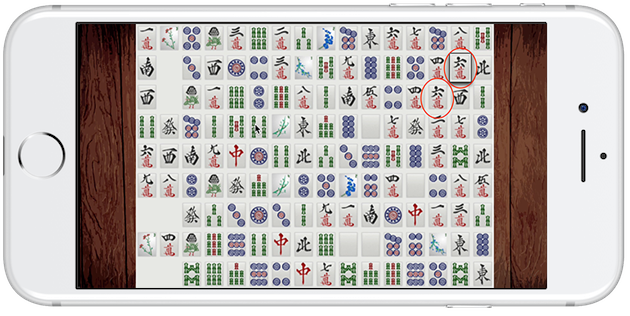

## [Riley & Grey](https://www.rileygrey.com){:target="_blank"}

**Technical Lead / Software Engineer** [SKILLS HERE]

A full set of Mahjong tiles are laid out on the board as a 16x9 grid. The player must 	match two identical tiles given the following set of rules:
- Two tilesw can be matched if they are the same characters and no other tiles are in between the two tiles. Adjacent tiles can always be matched.
- If a tile a matched, they are removed from the board.
- A tile can be used as a focal point to push a group of tiles through empty space on the board. If the tile can be matched after displacement, the tiles are given their new positions. Otherwise, the displacement is reversed.

<!--  -->
<!--  -->
<!--  -->

---

## [Parcel](https://www.thisisparcel.com){:target="_blank"}

**Founding Engineer** [SKILLS HERE]

A full set of Mahjong tiles are laid out on the board as a 16x9 grid. The player must 	match two identical tiles given the following set of rules:
- Two tilesw can be matched if they are the same characters and no other tiles are in between the two tiles. Adjacent tiles can always be matched.
- If a tile a matched, they are removed from the board.
- A tile can be used as a focal point to push a group of tiles through empty space on the board. If the tile can be matched after displacement, the tiles are given their new positions. Otherwise, the displacement is reversed.

<!--  -->
<!--  -->
<!--  -->

---

## [Friend & Family Foundry](https://www.friendsfamily.co){:target="_blank"}

**Software Engineer** [SKILLS HERE]

Friends & Family is a socially conscious NYC based digital foundry that helps both large and small brands build and test new digital ideas extremely quickly. We enable companies to stay ahead of a rapidly changing digital world while empowering them toward a more innovative culture.

- Two tilesw can be matched if they are the same characters and no other tiles are in between the two tiles. Adjacent tiles can always be matched.
- If a tile a matched, they are removed from the board.
- A tile can be used as a focal point to push a group of tiles through empty space on the board. If the tile can be matched after displacement, the tiles are given their new positions. Otherwise, the displacement is reversed.

<!--  -->
<!--  -->
<!--  -->

